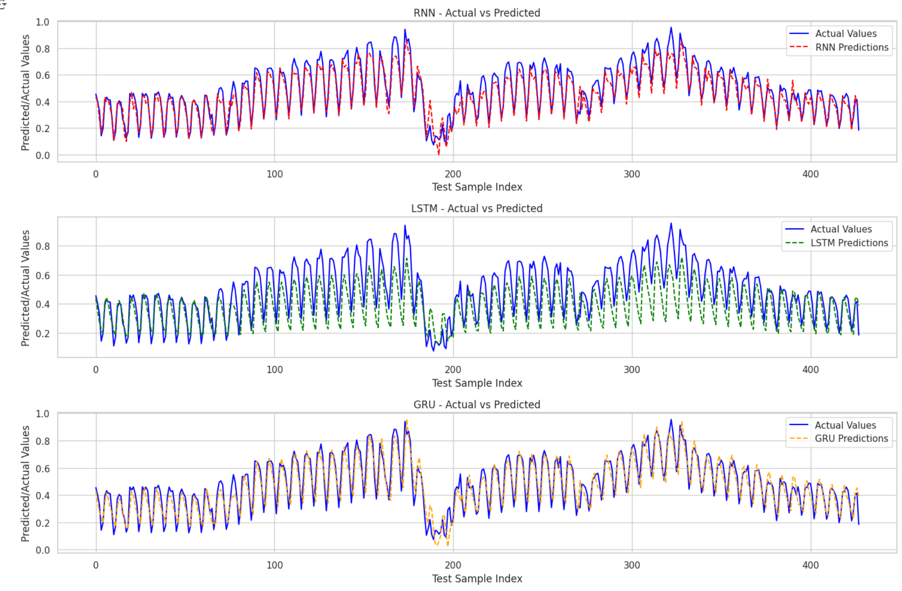

# Web Traffic Forecasting Project
## Overview
In this project, we experiment with different types of Recurrent Neural Networks (RNN, LSTM, GRU) to find the best model for web traffic forecasting, evaluating each model's performance and selecting the most accurate one for the task.

## Business Problem

For online businesses, accurately predicting website traffic patterns is critical for operational efficiency and strategic planning. Sudden traffic surges can overwhelm servers, leading to potential downtime, missed opportunities, and reputational damage. Conversely, periods of low traffic may indicate ineffective marketing or suboptimal engagement with target audiences.

- **Optimize Marketing**: Schedule promotions and target ads when traffic is expected to peak.
- **Manage Server Capacity**: Prepare for traffic surges to avoid downtime and ensure smooth user experiences.
- **Enhance Engagement**: Improve user engagement by delivering targeted content at optimal times.

## Model Comparison

Three deep learning models were tested for this forecasting task:

1. **RNN (Recurrent Neural Network)**  
   A basic RNN was implemented as a baseline model. RNNs handle sequential data well but struggle with long-term dependencies.

2. **LSTM (Long Short-Term Memory)**  
   LSTMs are designed to capture longer-term dependencies, making them effective for time series data with seasonal trends. They typically outperform basic RNNs for complex sequences.

3. **GRU (Gated Recurrent Unit)**  
   GRUs are a simplified version of LSTMs, often providing similar accuracy with fewer parameters, which can lead to faster training times.

## Results

After comparing model performance, the **RNN** was chosen as the best model for predicting web traffic patterns. Although more advanced models like LSTM and GRU are designed to capture complex, long-term dependencies, the relatively straightforward nature of this dataset allowed the RNN to perform well. RNNs have a simpler structure that can make them more efficient and less prone to overfitting on less complex datasets, and in this case, they generalized better to the validation data.

## Future Directions
1. **Experiment with Hybrid Models**: Try combining RNN layers with convolutional layers (e.g., CNN-RNN) to capture both short-term and long-term patterns in the data. This hybrid approach might reveal additional trends that a simple RNN alone may miss.

2. **Test Transformer Models**: While Transformers are more commonly used in natural language processing, they have been increasingly applied to time series forecasting. Experimenting with a Transformer-based model might improve the accuracy of long-term predictions, especially if more complex patterns are present in the data.

3. **Incorporate External Data Sources**: Integrate additional data sources, like social media engagement or search trends, which could correlate with traffic spikes. Adding these external signals might make the model more robust and help it anticipate sudden changes in traffic.

